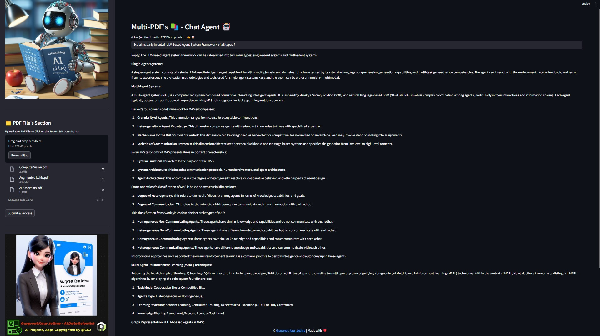
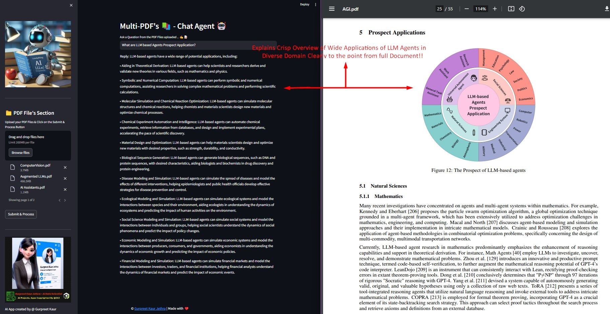
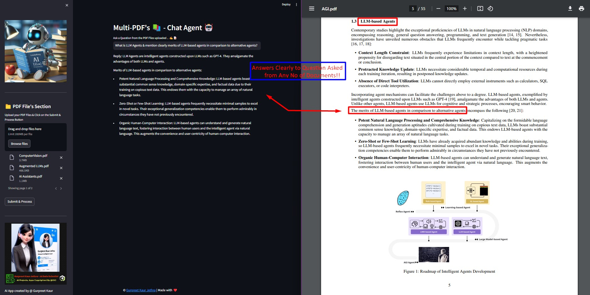

# 📚 ChatPDF - Multi-PDF AI Chat App 🤖

Chat seamlessly with multiple PDFs using **LangChain, Google Gemini Pro, and FAISS Vector DB**, all deployed on **Streamlit**. Get **instant, accurate responses** from the **Google Gemini OpenAI-powered** chatbot! 🚀✨

---

## 🌍 **Live Demo**

🔹 **Run App with Streamlit Cloud**  
[🚀 Launch on Streamlit](https://multi-pdfschatappai-agent.streamlit.app/)

---

## 🎯 **How It Works**
### 📌 **System Overview**


1. **PDF Loading** → Upload and extract text from multiple PDFs.  
2. **Text Chunking** → Splitting extracted text into manageable chunks.  
3. **AI Model Processing** → Google Gemini Pro generates **embeddings** for text.  
4. **Similarity Matching** → The AI finds the most relevant chunks for each query.  
5. **AI Response Generation** → Chatbot provides **accurate responses** from PDFs.

📌 Example:


---

## 🔥 **Key Features**
✅ **Multi-PDF Conversational AI** - Ask questions across multiple PDFs.  
✅ **Google Gemini Pro & OpenAI LLM Support** - Advanced AI-powered responses.  
✅ **Adaptive Chunking** - Sliding Window technique for **better data retrieval**.  
✅ **File Compatibility** - Supports **PDF and TXT** file formats.  
✅ **Seamless Integration** - Works with **FAISS Vector DB** for fast query responses.  

📌 Example:


---

## 🏗 **Tech Stack**
- **LangChain** (Conversational Retrieval & AI Integration)
- **Google Gemini Pro** (LLM-powered chat responses)
- **OpenAI GPT-3 & Anthropic Claude** (Optional LLM models)
- **FAISS Vector DB** (Efficient search & indexing)
- **Streamlit** (Web UI)
- **PyPDF2** (Extracting text from PDFs)

📌 Example:


---

## 🛠 **Installation & Setup**

### 1️⃣ Clone the Repository  
```sh
git clone https://github.com/GURPREETKAURJETHRA/Multi-PDFs_ChatApp_AI-Agent.git
cd Multi-PDFs_ChatApp_AI-Agent
```

# 2️⃣ Install Dependencies
```sh
pip install -r requirements.txt
```

# 3️⃣ Set Up API Keys
```sh

# Create a .env file in the root directory and add:
echo "GOOGLE_API_KEY=your-api-key-here" >> .env
```

# 4️⃣ Run the App
```sh
streamlit run app.py
```

## 🚀 Usage Guide
-Upload multiple PDFs to the app.
-Click "Process" to extract and chunk text.
-Ask questions in natural language.
-AI chatbot will provide accurate answers from PDFs.

## 📊 Future Enhancements
🔹 Real-time Camera OCR for PDFs 📷
🔹 More AI Models (GPT-4, Claude, Llama2)
🔹 Multilingual Support for PDF Chat 🌍
🔹 Custom Voice Response AI Integration 🎙️ 


## ⭐ Support & Contributions
💡 If you like this **AI-powered Image-to-Speech Tool**, **drop a ⭐ on GitHub!**  
